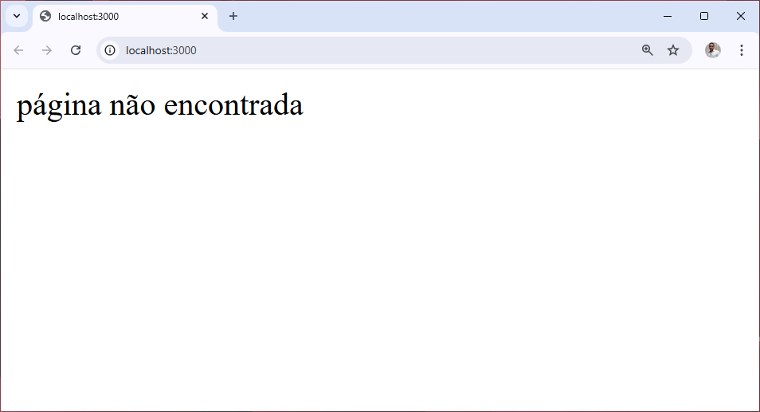

**versao do laboratório:** 1.0.0

**Data Criaçao:** 08/10/2025

# Descrição do Laboratório

Neste laboratório vamos preparar todo o ambiente para usar o projeto

# Objetivos do Laboratório

Compreender :

- Ambiente de desenvolvimento node
- Framework Express
- View Engine EJS(Embedded JavaScript templates)

# Pré-Requisitos

- Node instalado

# Links para estudo e consulta

**_Pagina Oficial do Express_**

https://expressjs.com/

**_Pagina Oficial do EJS_**

https://ejs.co/

# 1. Preparando o ambiente

Iniciar o projeto
`npm init`

**_Exemplo de saida_**

```
npm init
This utility will walk you through creating a package.json file.
It only covers the most common items, and tries to guess sensible defaults.

See `npm help init` for definitive documentation on these fields
and exactly what they do.

Use `npm install <pkg>` afterwards to install a package and
save it as a dependency in the package.json file.

Press ^C at any time to quit.
package name: (proj-exp-ejs)
version: (1.0.0)
description:
entry point: (index.js)
test command:
git repository:
keywords:
author:
license: (ISC)
type: (commonjs)
About to write to C:\Users\josue.rosario\Documents\proj-exp-ejs\package.json:

{
  "name": "proj-exp-ejs",
  "version": "1.0.0",
  "description": "",
  "main": "index.js",
  "directories": {
    "doc": "docs"
  },
  "scripts": {
    "test": "echo \"Error: no test specified\" && exit 1"
  },
  "author": "",
  "license": "ISC",
  "type": "commonjs"
}


Is this OK? (yes)
```

obs: Verificar se existe um arquivo package.json

====================================

# 2.Instalando as dependências

Instalar o Framework Express

`npm i express`

Exemplo de saida

```
npm i express

added 68 packages, and audited 69 packages in 6s

16 packages are looking for funding
  run `npm fund` for details

found 0 vulnerabilities
```

instalar o view engine ejs

`npm i ejs`

Exemplo de saída

```
 npm i ejs

added 8 packages, and audited 77 packages in 5s

16 packages are looking for funding
  run `npm fund` for details

found 0 vulnerabilities
```

Verifique se a pasta node_modules foi instalada. Esta pasta contém os códigos do express, do ejs e das outra dependencias necessárias. Esta pasta não deve subir para o repositório remoto do github, acrescente um arquivo .gitignore para evitar que a pasta seja enviada ao github

Adicione o arquivo .gitignore

```
# Logs
logs
*.log
npm-debug.log*
yarn-debug.log*
yarn-error.log*
lerna-debug.log*

# Diagnostic reports (https://nodejs.org/api/report.html)
report.[0-9]*.[0-9]*.[0-9]*.[0-9]*.json

# Runtime data
pids
*.pid
*.seed
*.pid.lock

# Directory for instrumented libs generated by jscoverage/JSCover
lib-cov

# Coverage directory used by tools like istanbul
coverage
*.lcov

# nyc test coverage
.nyc_output

# Grunt intermediate storage (https://gruntjs.com/creating-plugins#storing-task-files)
.grunt

# Bower dependency directory (https://bower.io/)
bower_components

# node-waf configuration
.lock-wscript

# Compiled binary addons (https://nodejs.org/api/addons.html)
build/Release

# Dependency directories
node_modules/
jspm_packages/

# Snowpack dependency directory (https://snowpack.dev/)
web_modules/

# TypeScript cache
*.tsbuildinfo

# Optional npm cache directory
.npm

# Optional eslint cache
.eslintcache

# Optional stylelint cache
.stylelintcache

# Optional REPL history
.node_repl_history

# Output of 'npm pack'
*.tgz

# Yarn Integrity file
.yarn-integrity

# dotenv environment variable files
.env
.env.*
!.env.example

# parcel-bundler cache (https://parceljs.org/)
.cache
.parcel-cache

# Next.js build output
.next
out

# Nuxt.js build / generate output
.nuxt
dist

# Gatsby files
.cache/
# Comment in the public line in if your project uses Gatsby and not Next.js
# https://nextjs.org/blog/next-9-1#public-directory-support
# public

# vuepress build output
.vuepress/dist

# vuepress v2.x temp and cache directory
.temp
.cache

# Sveltekit cache directory
.svelte-kit/

# vitepress build output
**/.vitepress/dist

# vitepress cache directory
**/.vitepress/cache

# Docusaurus cache and generated files
.docusaurus

# Serverless directories
.serverless/

# FuseBox cache
.fusebox/

# DynamoDB Local files
.dynamodb/

# Firebase cache directory
.firebase/

# TernJS port file
.tern-port

# Stores VSCode versions used for testing VSCode extensions
.vscode-test

# yarn v3
.pnp.*
.yarn/*
!.yarn/patches
!.yarn/plugins
!.yarn/releases
!.yarn/sdks
!.yarn/versions

# Vite logs files
vite.config.js.timestamp-*
vite.config.ts.timestamp-*
```

# 3.Criando o entry-point da aplicação

Crie o arquivo index.js

```javascript
//importações necessárias
const express = require("express");

//criando o app
app = express();

//configurações iniciais
porta = 3000;

//rotas da aplicação
//============================

// rota de erro 404
app.use((req, res) => {
  res.status(404).send("página não encontrada");
});

//Colocando o servidor no ar
//============================
app.listen(porta, () => {
  console.log("servidor rodando");
  console.log(`Acesse: http://localhost:${porta}`);
});
```

Acrescente o comando de inicialização

```json
  "scripts": {
    "test": "echo \"Error: no test specified\" && exit 1",
    "dev": "node index.js" //linha inserida
  },
```

Teste a aplicação

`npm run dev`

saida da console

```
npm run dev

> proj-exp-ejs@1.0.0 dev
> node index.js

servidor rodando
Acesse: http://localhost:3000
```

saida da aplicação



================================
caminho\do\arquivo.ext

```javascript
console.log(teste);
```

caminho\do\arquivo.ext

```html
<html>
  <p>exemplo de html</p>
</html>
```

caminho\do\arquivo.ext

```css
h1,
p {
  font-size: 50px;
}
```


| titulo 1 | titulo 2 | titulo 3 |
| -------- | -------- | -------- |
| dado 1   | dado 2   | dado 3   |

# Alterações Executadas

| Data       | Responsável   | Descrição           |
| ---------- | ------------- | ------------------- |
| 29/08/2025 | Josué Rosario | Criação do Tutorial |
