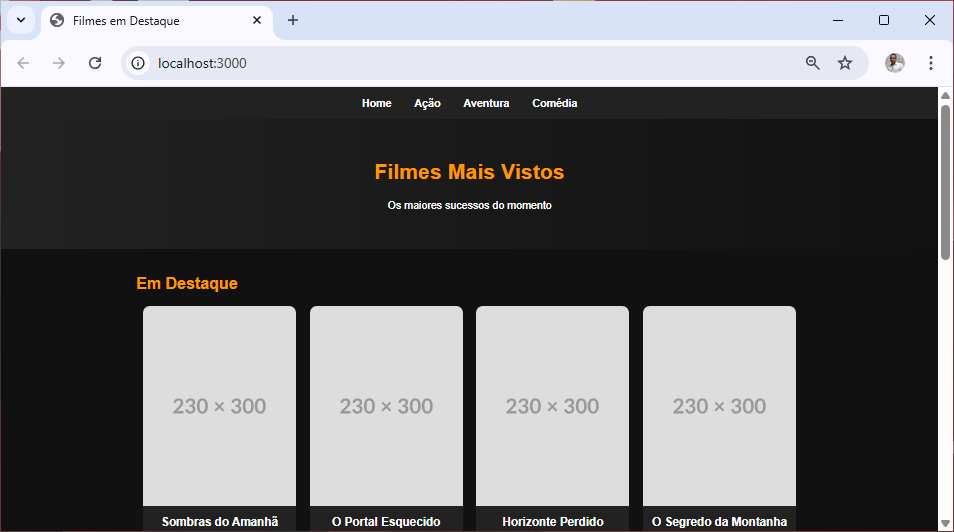

**versao do laboratório:** 1.0.0

**Data Criaçao:** 08/10/2025

# Descrição do Laboratório

vamos configurar o ejs, nossas primeiras views e a pasta public

# Objetivos do Laboratório

Compreender :

- o que é o ejs
- o conceito de MVC
- arquivos estáticos
- problemas de segurança relacionados a pasta public

# 1. Configurando o EJS

configure o ejs e a pasta o caminho da pasta de views

index.js

```javascript
//configurações iniciais
porta = 3000;
app.set("view engine", "ejs"); //adicionado
app.set("views", "./views"); //adicionado
```

Crie a pasta views

# 2. Criando a primeira view

./views/index.ejs

```html
<!DOCTYPE html>
<html lang="pt-br">
  <head>
    <meta charset="UTF-8" />
    <meta name="viewport" content="width=device-width, initial-scale=1.0" />
    <title>Filmes em Destaque</title>
    <style>
      body {
        font-family: Arial, Helvetica, sans-serif;
        margin: 0;
        background-color: #111;
        color: #fff;
      }

      nav {
        background-color: #222;
        padding: 15px;
        text-align: center;
      }

      nav li {
        list-style: none;
      }

      nav a {
        color: #fff;
        text-decoration: none;
        margin: 0 15px;
        font-weight: bold;
        transition: color 0.3s;
      }

      nav a:hover {
        color: #ff9800;
      }

      header {
        text-align: center;
        padding: 40px 10px;
        background: linear-gradient(to right, #222, #111);
      }

      header h1 {
        font-size: 2em;
        color: #ff9800;
      }

      .filmes {
        padding: 20px;
        max-width: 1000px;
        margin: 0 auto;
      }

      .filmes h2 {
        color: #ff9800;
        margin-bottom: 20px;
      }

      .cards {
        display: flex;
        flex-wrap: wrap;
        gap: 20px;
        justify-content: center;
      }

      .card {
        background-color: #222;
        border-radius: 10px;
        overflow: hidden;
        width: 230px;
        text-align: center;
        transition: transform 0.3s;
      }

      .card:hover {
        transform: scale(1.05);
      }

      .card img {
        width: 100%;
        height: 300px;
        object-fit: cover;
      }

      .card h3 {
        margin: 10px 0;
        font-size: 1.1em;
      }

      .card p {
        font-size: 0.9em;
        margin: 5px 10px;
        color: #ccc;
      }

      .card .descricao {
        font-style: italic;
        margin-top: 5px;
      }

      .card .info {
        color: #ff9800;
        font-weight: bold;
      }
    </style>
  </head>
  <body>
    <nav>
      <li>
        <a href="/">Home</a>
        <a href="#">Ação</a>
        <a href="#">Aventura</a>
        <a href="#">Comédia</a>
      </li>
    </nav>

    <header>
      <h1>Filmes Mais Vistos</h1>
      <p>Os maiores sucessos do momento</p>
    </header>

    <section class="filmes">
      <h2>Em Destaque</h2>
      <div class="cards">
        <div class="card">
          
          <h3>Sombras do Amanhã</h3>
          <p class="descricao">
            Um herói improvável embarca em uma jornada para salvar o mundo de
            uma ameaça misteriosa.
          </p>
          <p class="info"><strong>Data:</strong> 12/07/2024</p>
          <p class="info"><strong>Gênero:</strong> Ação / Aventura</p>
        </div>

        <div class="card">
          
          <h3>O Portal Esquecido</h3>
          <p class="descricao">
            Uma jovem descobre um portal mágico e precisa restaurar o equilíbrio
            entre dois mundos.
          </p>
          <p class="info"><strong>Data:</strong> 20/02/2023</p>
          <p class="info"><strong>Gênero:</strong> Fantasia / Drama</p>
        </div>

        <div class="card">
          
          <h3>Horizonte Perdido</h3>
          <p class="descricao">
            Uma equipe de cientistas enfrenta criaturas desconhecidas em um
            planeta distante.
          </p>
          <p class="info"><strong>Data:</strong> 05/09/2022</p>
          <p class="info"><strong>Gênero:</strong> Ficção Científica</p>
        </div>

        <div class="card">
          
          <h3>O Segredo da Montanha</h3>
          <p class="descricao">
            Dois amigos de infância se reencontram e precisam resolver um
            mistério antigo.
          </p>
          <p class="info"><strong>Data:</strong> 11/03/2024</p>
          <p class="info"><strong>Gênero:</strong> Mistério / Drama</p>
        </div>

        <div class="card">
          
          <h3>Linha de Fogo</h3>
          <p class="descricao">
            Uma policial tenta desvendar uma série de crimes ligados a uma
            organização secreta.
          </p>
          <p class="info"><strong>Data:</strong> 29/08/2023</p>
          <p class="info"><strong>Gênero:</strong> Ação / Suspense</p>
        </div>

        <div class="card">
          
          <h3>Rota Infinita</h3>
          <p class="descricao">
            Um grupo de amigos embarca em uma viagem de carro que muda suas
            vidas para sempre.
          </p>
          <p class="info"><strong>Data:</strong> 14/12/2022</p>
          <p class="info"><strong>Gênero:</strong> Comédia / Drama</p>
        </div>

        <div class="card">
          
          <h3>Códigos de Aço</h3>
          <p class="descricao">
            Um robô adquire consciência e precisa aprender o que significa ser
            humano.
          </p>
          <p class="info"><strong>Data:</strong> 01/06/2025</p>
          <p class="info"><strong>Gênero:</strong> Ficção Científica</p>
        </div>

        <div class="card">
          
          <h3>Ecos do Silêncio</h3>
          <p class="descricao">
            Uma detetive enfrenta seu passado enquanto investiga um caso de
            desaparecimento.
          </p>
          <p class="info"><strong>Data:</strong> 18/10/2023</p>
          <p class="info"><strong>Gênero:</strong> Thriller / Policial</p>
        </div>

        <div class="card">
          
          <h3>O Último Prato</h3>
          <p class="descricao">
            Um chef tenta reconstruir sua carreira após um escândalo em um
            restaurante renomado.
          </p>
          <p class="info"><strong>Data:</strong> 22/04/2024</p>
          <p class="info"><strong>Gênero:</strong> Drama / Culinária</p>
        </div>

        <div class="card">
          
          <h3>Vozes do Amanhã</h3>
          <p class="descricao">
            Uma jovem cantora tenta alcançar o sucesso enfrentando desafios e
            traições.
          </p>
          <p class="info"><strong>Data:</strong> 09/01/2023</p>
          <p class="info"><strong>Gênero:</strong> Musical / Romance</p>
        </div>
      </div>
    </section>
  </body>
</html>
```

crie a rota para chamar a view index.ejs

index.js

```javascript
//rotas da aplicação
//============================

// rota home
app.get("/", (req, res) => {
  res.render("index");
});
```

feche o servidor de estiver no ar `ctrl + c` e rode novamente a aplicação

`npm run dev`

resultado esperado



# 3. Configurando a pasta public

Vamos configurar uma pasta public para conter arquivos que serão usados pelas views e que não se alteram com frequencia

index.js

```javascript
//configurações iniciais
porta = 3000;
app.set("view engine", "ejs");
app.set("views", "./views");
app.use(express.static("public")); //linha adicionada
```

crie uma pasta chamada public

# 4. Movendo o CSS da view index para a pasta public

dentro de public crie a pasta css para guardar o css da aplicação

mover todo o css da aplicação para dentro do arquivo index.css. Não se esqueça de tirar a tag style tanto da view quanto do css

Altere o head da view para linkar com o CSS que esta dentro da pasta public/css

```html
<head>
  <meta charset="UTF-8" />
  <meta name="viewport" content="width=device-width, initial-scale=1.0" />

  <!-- carrega o style que está dentro de public -->
  <link rel="stylesheet" href="/css/styles.css" />

  <title>Filmes em Destaque</title>
</head>
```

Feche a aplicação com `CTRL + C` e rode novamente `npm run dev`

# 5. Criando a rota acao

acrescentar o seguinte css

./public/css/styles.css

```css
/* ======== ESTILOS DA TABELA ======== */
table {
  width: 80%;
  margin: 40px auto;
  border-collapse: collapse;
  font-family: Arial, sans-serif;
  background-color: #222;
  color: #eee;
  border-radius: 10px;
  overflow: hidden;
  box-shadow: 0 0 10px rgba(0, 0, 0, 0.3);
}

thead {
  background-color: #ff4747;
}

th,
td {
  padding: 15px 20px;
  text-align: left;
}

th {
  text-transform: uppercase;
  letter-spacing: 1px;
  font-weight: bold;
}

tr:nth-child(even) {
  background-color: #2c2c2c;
}

tr:hover {
  background-color: #333;
  transition: 0.3s;
}

caption {
  caption-side: top;
  margin-bottom: 15px;
  font-size: 1.5em;
  font-weight: bold;
  color: #ff4747;
}
```

**\*Problemas que precisamos resolver**

- O menu se repete nas duas views, se precisamos dar manutenção no menu, será necessário fazer as mesmas alterações duas vezes.
- O menu da aplicação não está ligado as rotas da aplicação, permanece estático.

# Alterações Executadas

| Data       | Responsável   | Descrição           |
| ---------- | ------------- | ------------------- |
| 08/10/2025 | Josué Rosario | Criação do Tutorial |
