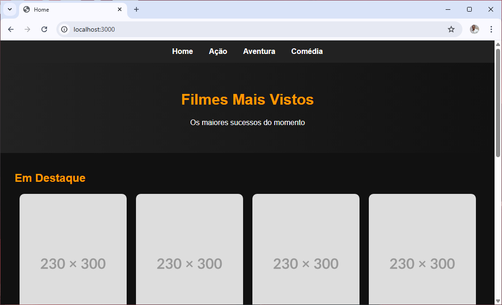
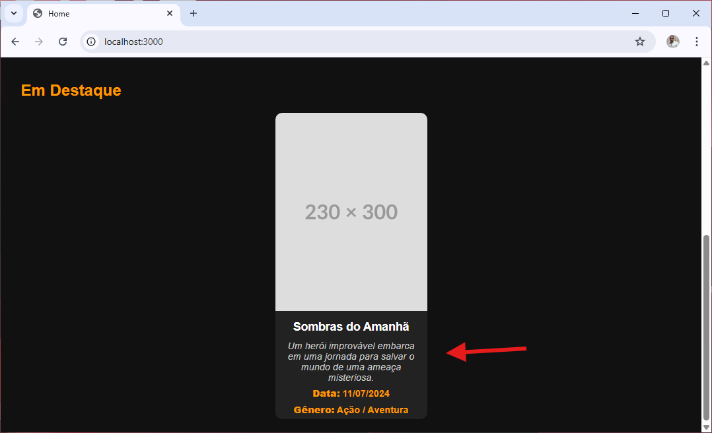

**versao do laboratório:** 1.0.0

**Data Criaçao:** 15/10/2025

# Descrição do Laboratório

Os dados de todas as views estão hardcoded. Neste tutorial vamos transferir dados para que as views sejam corretamente mostradas

# Objetivos do Laboratório

Compreender :

- Transferencia de dados para views ejs

# 1. Tranformando o titulo em variável

Modifique o head.ejs para trabalhar com a variável titulo dentro de title

```html
<head>
  <meta charset="UTF-8" />
  <meta name="viewport" content="width=device-width, initial-scale=1.0" />
  <link rel="stylesheet" href="./css/styles.css" />
  <title><%= titulo %></title>
</head>
```

A partir de agora todas as views renderizadas devem ser chamadas com a a variável titulo

index.js

```javascript
app.get("/", (req, res) => {
  res.render("index", { titulo: "Home" }); //linha alterada
});

app.get("/acao", (req, res) => {
  res.render("acao", { titulo: "Filmes de Ação" }); //linha alterada
});
```

Faça um teste chamado as rotas e analise se os titulos estão corretos



# 2. Transferindo dados de filmes

Modifique a rota home para enviar os dados de filmes

```javascript
// rota home
app.get("/", (req, res) => {
  dadosFilmes = [
    {
      titulo: "Sombras do Amanhã",
      descricao:
        "Um herói improvável embarca em uma jornada para salvar o mundo de uma ameaça misteriosa.",
      data_lancamento: "2024-07-12",
      genero: ["Ação", "Aventura"],
      imagem: "https://placehold.co/230x300",
    },
  ];
  res.render("index", { titulo: "Home", dados: dadosFilmes });
});
```

Para saber se os dados estão chegando realmente na view vamos acrescentar duas linhas de debug logo no inicio do body

```html
<body>
  <h2>Debug dos dados</h2>
  <pre><%= JSON.stringify(dados, null, 2) %></pre>

  <!-- menu de opções -->
  <%- include('./partials/menu') %>
</body>
```

| funcao/argumento          | Descrição                                         |
| ------------------------- | ------------------------------------------------- |
| stringify(dados, null, 2) | Transforma JSON em string                         |
| dados                     | variavel dados sendo enviada                      |
| null                      | Nenhum filtro deve ser feito                      |
| 2                         | Dados dentro de dados são identados com 2 espaços |

Antes de realmente configurar o card vamos analisar como fazer para recuperar os dados individuais do filme. Em index.ejs vamos colocar um forEach logo abaixo da div com a class cards para tratar os dados que foram enviados individualmente

views\index.ejs

```html
<div class="cards">
  <% dados.forEach((filme)=>{ %>
  <h3><%= filme.titulo %></h3>
  <%}) %>
</div>
```

| comando                      | Descrição                                                                                                |
| ---------------------------- | -------------------------------------------------------------------------------------------------------- |
| `dados.forEach((filme)=>{})` | Para cada linha dentro dados executa a função de callback. A linha terá o nome de filme dentro da função |
| `<%= filme.titulo %>`        | cola o nome do filme no html dentro de um h3                                                             |

O resultado será o nome dos filmes enviados sendo mostrados antes de todos os cards no html


# 3. Chamando os cards com os dados do filme

Neste ponto temos condições de chamar os cards passando os dados dos filmes. Modifique a div com a class cards da seguinte maneira :

views\index.ejs

```html
<div class="cards">
  <% dados.forEach((filme)=>{ %> <%- include('./partials/card', { filme: filme
  }) %> <%}) %>
</div>
```

observe que foram retirados os includes em excesso

No card vamos alterar os dados hard coded para os dados enviados

views\partials\card.ejs

```html
<div class="card">
  " alt="Sombras do Amanhã" />
  <h3><%= filme.titulo %></h3>
  <p class="descricao"><%= filme.descricao %></p>
  <p class="info">
    <strong>Data:</strong> <%= new
    Date(filme.data_lancamento).toLocaleDateString('pt-BR') %>
  </p>
  <p class="info"><strong>Gênero:</strong> <%= filme.genero.join(" / ") %></p>
</div>
```

A data precisa ser convertida para o formato brasileiro antes de ser mostrada. Isto é feito convertendo a data para o objeto date e configurando com toLocaleDateString()

O genero está sendo enviado como um array, O método join devolve os valores do array separados por barra



obs: As linhas de Debug dentro de index.ejs podem ser retiradas ou comentadas.

# Alterações Executadas

| Data       | Responsável   | Descrição           |
| ---------- | ------------- | ------------------- |
| 15/10/2025 | Josué Rosario | Criação do Tutorial |
